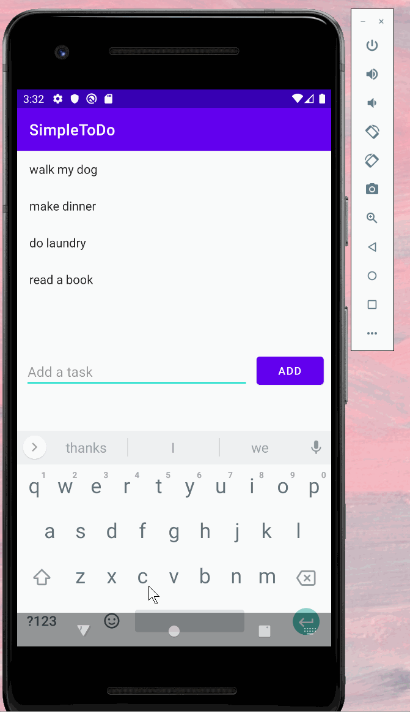
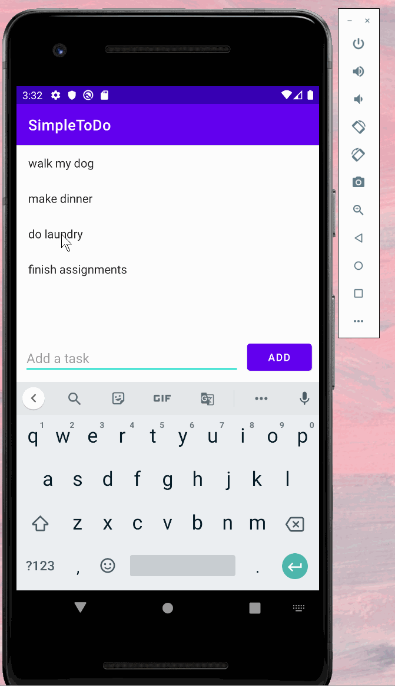
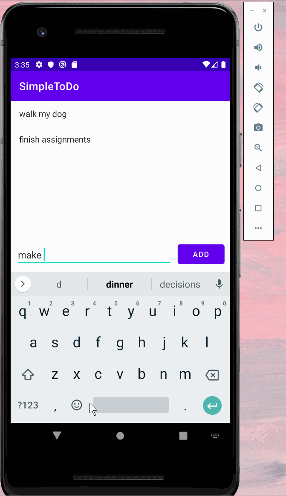

# SimpleToDo

**SimpleToDo** is an android app that allows building a todo list and basic todo items management functionality including adding new items, editing and deleting an existing item.

Submitted by: **Weiyi Chen**

Time spent: **2** hours spent in total

## User Stories

The following **required** functionality is completed:

* [ ] User can **view a list of todo items**  
* [ ] User can **successfully add and remove items** from the todo list
* [ ] User's **list of items persisted** upon modification and and retrieved properly on app restart

## Video Walkthrough

Here's a walkthrough of implemented user stories:

  

  

  

## License

    Copyright [2021] [Weiyi Chen]

    Licensed under the Apache License, Version 2.0 (the "License");
    you may not use this file except in compliance with the License.
    You may obtain a copy of the License at

        http://www.apache.org/licenses/LICENSE-2.0

    Unless required by applicable law or agreed to in writing, software
    distributed under the License is distributed on an "AS IS" BASIS,
    WITHOUT WARRANTIES OR CONDITIONS OF ANY KIND, either express or implied.
    See the License for the specific language governing permissions and
    limitations under the License.
